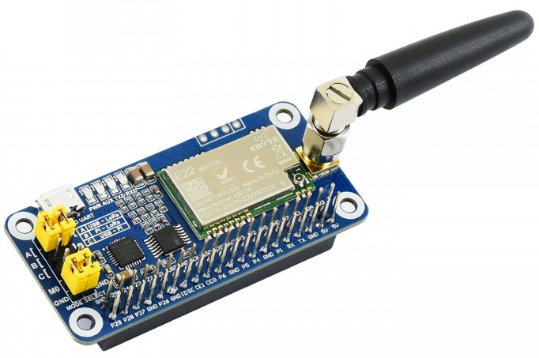

# piramesh: Simple LoRa based off-grid communicator demo

Based on a Raspberry PI Zero W with [Waveshare SX1262 LoRa HAT](https://thepihut.com/products/sx1262-lora-hat-for-raspberry-pi-868mhz-for-europe-asia-africa).


Off-grid communicator demo / proof-of-concept. Using LoRa for long-range communication and a Raspberry PI as a local server. The local server will offer a web server that drives the LoRa hardware to send & receive messages. An example usage may be smartphone -> local wireless to the web server (piramesh) -> LoRa to another device with the same setup <- remote device <- remote smartphone.

## Setup

0. Hardware

I used two of these
- [Raspberry PI Zero WH (v1.1)](https://thepihut.com/products/raspberry-pi-zero-wh-with-pre-soldered-header)
- [SX1262 LoRa HAT for Raspberry Pi - 868MHz](https://thepihut.com/products/sx1262-lora-hat-for-raspberry-pi-868mhz-for-europe-asia-africa)
- [Uninterruptible Power Supply](https://thepihut.com/products/uninterruptible-power-supply-ups-hat-for-raspberry-pi-zero)

1. RPI OS

Using the [RPI Imager](https://www.raspberrypi.com/software/) I flashed Raspberry PI OS 32-bit lite (bullseye) onto microsd cards. Setting a unique hostname on each and ssh, wifi, etc so I could access them without attaching a screen.

2. Post OS Install

Update packages and install 
```shell
sudo apt update && sudo apt upgrade
sudo apt install build-essential vim-nox git
```

Install golang
```shell
wget https://go.dev/dl/go1.19.4.linux-armv6l.tar.gz
sudo tar -C /usr/local -xzf go1.19.4.linux-armv6l.tar.gz
export PATH=$PATH:/usr/local/go/bin # Add this to your .bashrc too
```

3. piramesh server

*todo*